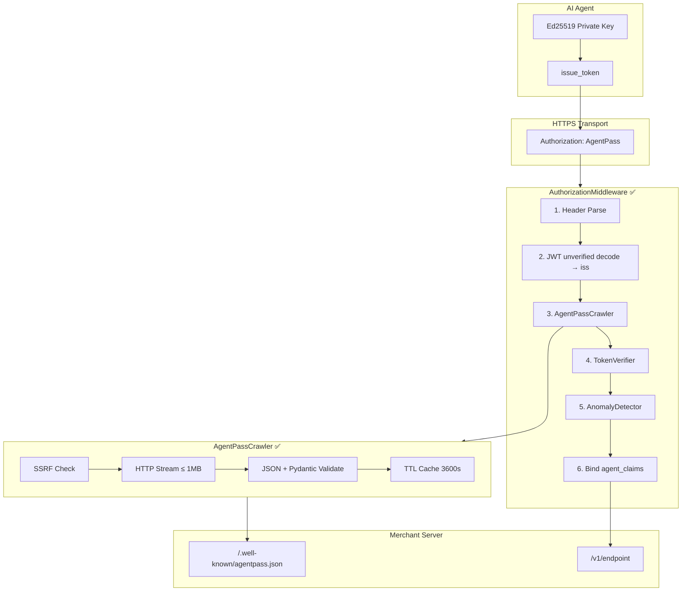
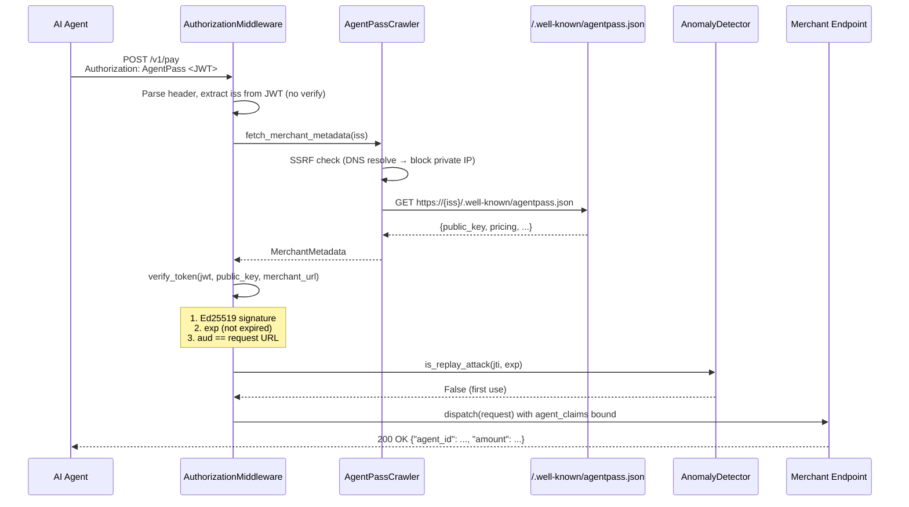
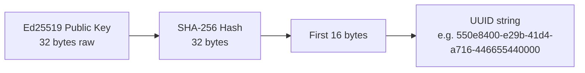
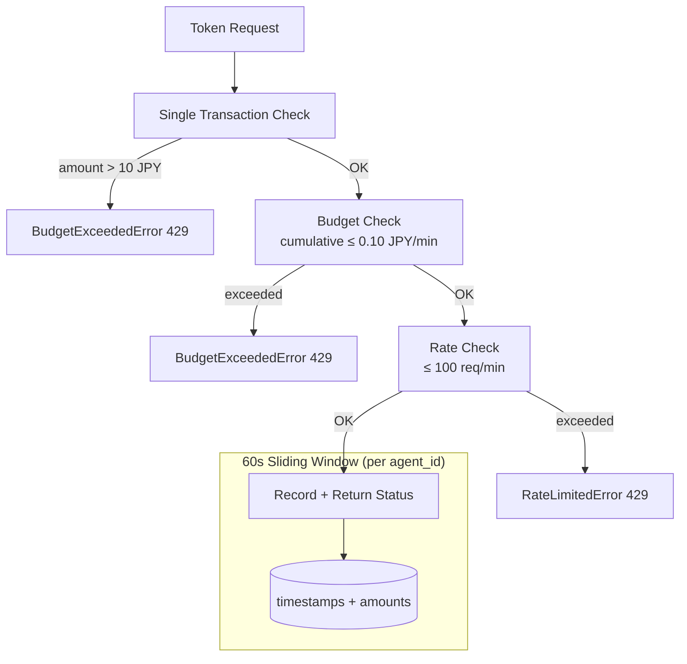
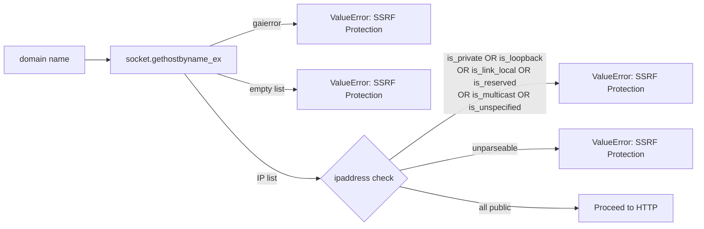
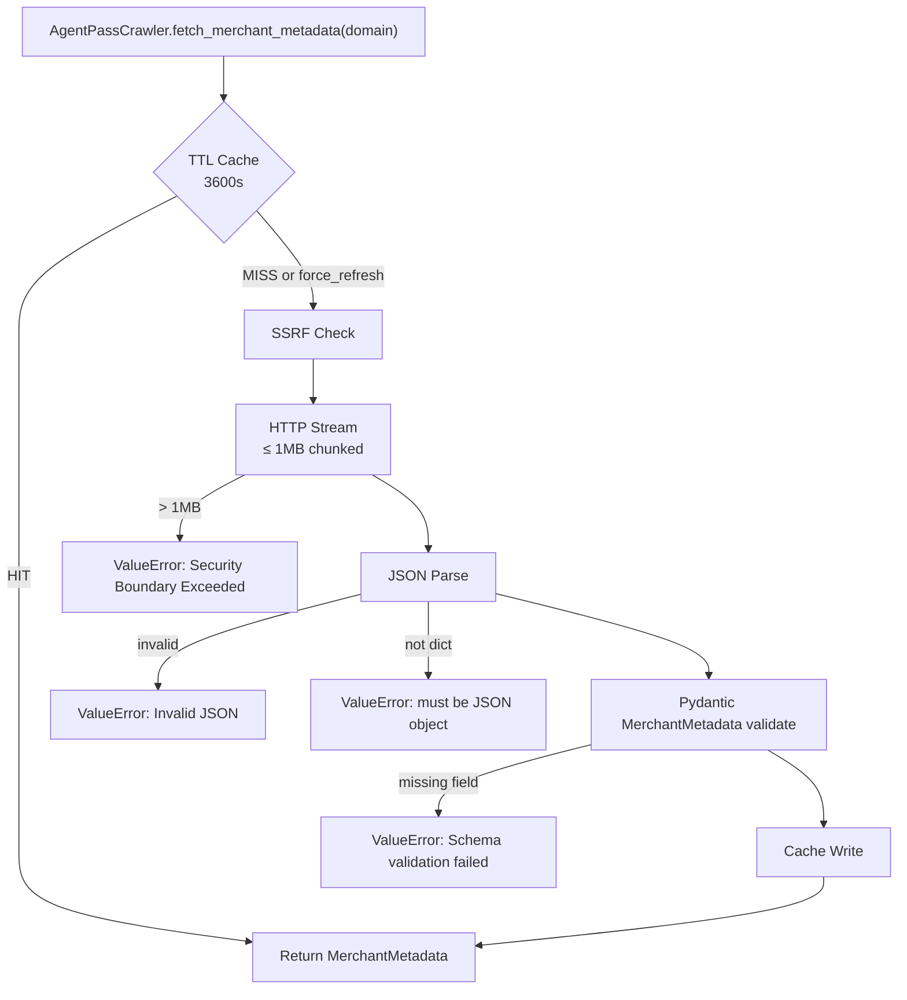
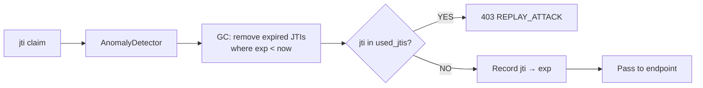

# AgentPass Architecture

> ✅ = 実装済み | 🔄 = 構築中 | 🔭 = 将来構想

---

## System Overview ✅



---

## Token Flow ✅



---

## Token Structure ✅

```
Header:
  alg: EdDSA
  typ: JWT

Payload:
  sub:  <agent_id>          # エージェント識別子
  iss:  <domain>             # 公開鍵取得元ドメイン
  aud:  <full URL>           # 宛先 URL（完全一致検証）
  iat:  <unix timestamp>     # 発行時刻
  exp:  <unix timestamp>     # 有効期限（最大300秒）
  jti:  <uuid4>              # 使い捨てID（リプレイ防止）
  amt:  <float JPY>          # 支払い額
  cur:  "JPY"                # 通貨（現在 JPY のみ）
  agp:  "1"                  # AgentPass プロトコルバージョン

Signature:
  Ed25519(private_key, header.payload)
```

---

## AgentID Derivation ✅



**実装:** `src/identity/agent_signer.py`
```python
def derive_agent_id(public_key_bytes: bytes) -> str:
    digest = hashlib.sha256(public_key_bytes).digest()
    return str(uuid.UUID(bytes=digest[:16]))
```

**特性:** 決定論的・同一公開鍵から常に同一UUID・衝突不可

---

## Circuit Breaker ✅



**デフォルト制限:**

| 制限 | 値 |
|------|-----|
| 単一トランザクション上限 | 10.00 JPY |
| 累積消費上限 | 0.10 JPY / 60秒 |
| 累積リクエスト上限 | 100 回 / 60秒 |
| スライディングウィンドウ | 60 秒 |

---

## SSRF Protection ✅



**⚠️ Python 3.14 注意:** `203.0.113.0/24`（RFC 5737 TEST-NET-3）は `is_private=True`  
テスト用モック公開IPは必ず `8.8.8.8` を使用。

---

## Merchant Verification ✅



---

## Replay Attack Defense ✅



---

## Package Structure ✅

```
src/
├── agentpass/          # 公開 API（pip install agentpass）
│   └── __init__.py     # 22シンボル flat export
├── core/               # 実装層
│   ├── token_issuer.py
│   ├── token_verifier.py
│   ├── circuit_breaker.py
│   ├── agentpass_crawler.py
│   ├── authorization_middleware.py
│   └── anomaly_detector.py
├── identity/           # アイデンティティ層
│   ├── agent_signer.py
│   └── credit_scorer.py
└── merchant/           # 旧設計（非推奨・参照専用）
```

---

## Sandbox Architecture 🔄

> **Status: 進行中**

```
TODO: Sandbox 構成図をここに追加
- 本番 API を呼び出さない隔離環境
- respx による httpx モック
- FakeTime による時刻制御
- 実験ログ → EXPERIMENT_LOG.md
```

---

## Future Architecture 🔭

```
TODO: Wave 2〜4 の技術アーキテクチャ
- AgentID レピュテーション DB
- 信用スコア公開 API
- M2M 清算レイヤー
- DID 統合
```
