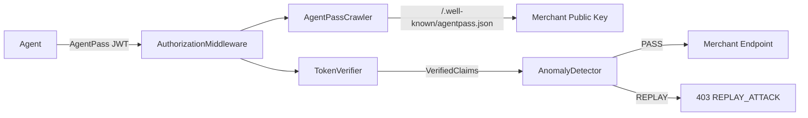

# AgentPass — AI Operations OS Reference

> M2M Wallet & Passport Infrastructure for AI Agents  
> Version: 1.0.0-beta1 | Python 3.14 | MIT License

---

## Vision

AIエージェントが人間と同じように経済活動する時代のインフラ。  
エージェントは署名済みJWT（パスポート）を提示し、加盟店はその場で自律検証する。  
中央集権的なAPIキー管理も、サードパーティ認証サーバーも不要。

```
Agent  ──[AgentPass JWT]──▶  Merchant API
         "I am agent-7f3a, paying 0.001 JPY/token"
              ▲ Ed25519 署名 + aud 固定 + jti 使い捨て
```

---

## Why Now

| 背景 | 機会 |
|------|------|
| AI エージェントの爆発的普及 | M2M 決済インフラが空白 |
| APIキー認証の限界（なりすまし・横流し） | EdDSA/JWT による暗号学的証明 |
| ゼロトラスト設計の要求 | aud 固定 + jti 使い捨て |
| AIエージェント間の自律連携 | iss クレームによる公開鍵自律取得 |

---

## Implementation Status

### ✅ 実装済み（153 tests passing）

| モジュール | 機能 | ファイル |
|---|---|---|
| `TokenIssuer` | Ed25519 署名付き JWT 発行 | `src/core/token_issuer.py` |
| `TokenVerifier` | 署名・期限・宛先の3段階検証 | `src/core/token_verifier.py` |
| `CircuitBreaker` | 60秒スライディングウィンドウ制限 | `src/core/circuit_breaker.py` |
| `AgentPassCrawler` | SSRF防御・1MB制限・TTLキャッシュ | `src/core/agentpass_crawler.py` |
| `AuthorizationMiddleware` | Starlette ASGI ミドルウェア | `src/core/authorization_middleware.py` |
| `AnomalyDetector` | JTI リプレイ攻撃検知 | `src/core/anomaly_detector.py` |
| `CreditScorer` | 信用スコア計算（0〜100） | `src/identity/credit_scorer.py` |
| `derive_agent_id` | SHA-256 → UUID 決定論的ID派生 | `src/identity/agent_signer.py` |
| Public API | `from agentpass import ...`（22シンボル） | `src/agentpass/__init__.py` |
| PyPI パッケージング | src-layout, v1.0.0-beta1 | `pyproject.toml` |

### 🔄 進行中

- Sandbox 検証フェーズ
- PyPI 公開手順整備（`build` + `twine` フロー）

### 🔭 将来構想

- Wave 2: 信用スコア公開 API（AgentID レピュテーションレイヤー）
- Wave 3: M2M 清算・為替・流動性プール
- Wave 4: AI 経済圏のレール（M2M 中央銀行）

---

## Quick Start (5 min)

```python
# 1. Install
# pip install agentpass fastapi uvicorn

# 2. Merchant side — add middleware
from fastapi import FastAPI
from starlette.requests import Request
from agentpass import AuthorizationMiddleware, AnomalyDetector

app = FastAPI()
app.add_middleware(AuthorizationMiddleware, anomaly_detector=AnomalyDetector())

@app.get("/v1/pay")
async def pay(request: Request):
    claims = request.state.agent_claims
    return {"agent_id": claims.agent_id, "amount": claims.amount}

# 3. Publish agentpass.json at /.well-known/agentpass.json
# {
#   "agentpass_version": "1.0.0",
#   "merchant_id": "<uuid>",
#   "public_key": "<64-char hex Ed25519 pubkey>",
#   "pricing": [{"endpoint": "/v1/pay", "price_per_token": 0.001}]
# }

# 4. Agent side — issue and send token
from agentpass import issue_token, TokenRequest, generate_keypair

private_key, _ = generate_keypair()
req = TokenRequest(
    agent_id="agent-7f3a",
    destination_url="https://api.merchant.com/v1/pay",
    amount_requested=0.001,
    purpose="data query",
)
issued = issue_token(req, private_key)

import httpx
resp = httpx.get(
    "https://api.merchant.com/v1/pay",
    headers={"Authorization": f"AgentPass {issued.token}"},
)
```

---

## Architecture Summary



---

## Sandbox Explanation

> **Status: 🔄 進行中**

Sandbox は本番 API を呼び出すことなく AgentPass フローを検証する環境。  
本ドキュメント基盤（`AI運営OS用/docs/`）は Sandbox 実験の知見を蓄積・資産化するための基盤でもある。

実験ログは `EXPERIMENT_LOG.md` へ記録。

---

## Document Map (AI Operations OS)

| ファイル | 用途 |
|---|---|
| `README.md` | 本ファイル。プロジェクト概要・クイックスタート |
| `ROADMAP.md` | 波1〜4・フェーズ・KPI |
| `BUSINESS_PLAN.md` | 事業モデル・収益化・競合分析 |
| `ARCHITECTURE.md` | 技術設計・Mermaid 図 |
| `API_SPEC.md` | エンドポイント・トークン仕様・エラーコード |
| `AI_INSTRUCTIONS.md` | AI エージェント向けコーディングルール |
| `TESTING_POLICY.md` | テスト方針・153件保護ルール |
| `EXPERIMENT_LOG.md` | Sandbox 実験・PoC ログ |
| `CONTRIBUTING.md` | OSS 貢献ガイドライン |

---

## Existing Docs (DO NOT DUPLICATE)

| ファイル | 場所 | 用途 |
|---|---|---|
| `README.md` | repo root | 開発者向けマーケティングドキュメント |
| `ai-instructions.md` | repo root | 機械可読仕様書（JWT スキーマ定義元） |
| `STRATEGY.md` | repo root | 3ホライゾン事業戦略 |
| `SPIDERMAP.md` | repo root | アーキテクチャ概観図 |
| `TODO.md` | repo root | タスク管理 |
