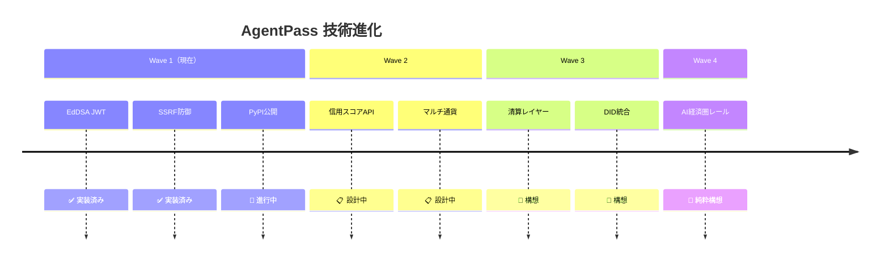

# AgentPass Roadmap

> 実装済み / 現在フェーズ / 中期 / 長期構想 を明確に分離する。

---

## Status Legend

| マーク | 意味 |
|--------|------|
| ✅ | 実装完了・テスト通過 |
| 🔄 | 現在進行中 |
| 📋 | 設計済み・未実装 |
| 🔭 | 構想段階（仮説） |

---

## Wave 1 — OSS 配布・5分導入（現在フェーズ）

**目標:** `pip install agentpass` で5分導入。M2M認証インフラの先占。

### ✅ 実装完了

| 機能 | 詳細 |
|------|------|
| EdDSA/JWT トークン発行・検証 | `issue_token()` / `verify_token()` |
| SSRF 防御クローラー | DNS 解決 + プライベートIP即拒否 |
| 1MB ストリーム制限 | 巨大レスポンス即切断 |
| TTLキャッシュ | `agentpass.json` を3600秒キャッシュ |
| サーキットブレーカー | 0.10 JPY/min・100 req/min スライディングウィンドウ |
| リプレイ攻撃防御 | `AnomalyDetector` JTI インメモリ管理 |
| ASGI ミドルウェア | `AuthorizationMiddleware` Starlette 統合 |
| 信用スコア | `CreditScorer` 0〜100 スケール |
| AgentID 派生 | `derive_agent_id()` SHA-256 → UUID |
| 公開 API | `from agentpass import ...`（22 シンボル） |
| PyPI 準拠パッケージング | `v1.0.0-beta1`・src-layout |
| テストスイート | 153 件オールグリーン |
| README | 開発者向け5分クイックスタート |

### 🔄 現在進行中

- Sandbox 検証
- PyPI 実公開（`python -m build` + `twine upload`）

### 📋 Wave 1 残タスク

- `CHANGELOG.md` 整備
- GitHub Actions CI/CD パイプライン
- `pip install agentpass` からのエンドツーエンド動作確認
- OSS ライセンスヘッダーの統一

### KPI（Wave 1）

| 指標 | 目標 | 現状 |
|------|------|------|
| PyPI ダウンロード数 | 1,000/月 | 0（未公開） |
| GitHub Stars | 500 | 0 |
| 5分導入成功率 | > 90% | - |
| テストカバレッジ | 100%（core crawler） | ✅ |

---

## Wave 2 — 双方向マーケット（中期）

**目標:** AgentID 信用スコアの公開 API 提供。加盟店がスコアで与信枠を動的制御。

> **Status: 🔭 構想段階**

### 構想中の機能

| 機能 | 仮説 |
|------|------|
| AgentID レピュテーション API | `GET /v1/agents/{agent_id}/score` |
| 動的与信枠 | スコアに応じて CircuitBreaker 閾値を自動調整 |
| スコア履歴 API | `GET /v1/agents/{agent_id}/history` |
| 加盟店ダッシュボード | リアルタイムM2Mトラフィック可視化 |
| マルチ通貨対応 | JPY 以外の `cur` クレーム対応 |

### KPI（Wave 2）

| 指標 | 目標 |
|------|------|
| アクティブエージェント数 | 10,000 |
| 加盟店数 | 100 |
| APIコール数/日 | 1,000,000 |

---

## Wave 3 — M2M 中央銀行（長期）

**目標:** エージェント間決済の清算・為替・流動性プール提供。

> **Status: 🔭 構想段階**

### 構想中の機能

| 機能 | 仮説 |
|------|------|
| M2M 清算レイヤー | エージェント間の微小決済をバッチ清算 |
| リアルタイム為替 | エージェント通貨（AGT）⇄ 法定通貨 |
| 流動性プール | エージェント間の資金融通 |
| AgentID DID 統合 | W3C Decentralized Identifiers 対応 |
| クロスボーダー M2M | 国際決済規制対応 |

---

## Wave 4 — AI 経済圏のレール（超長期）

**目標:** AIネイティブ経済圏の基幹インフラ。

> **Status: 🔭 純粋構想**

- AI 経済圏の「中央銀行」ポジション
- ヒューマン経済との接続レイヤー
- 自律エージェント間の契約・仲裁機構

---

## 技術進化ロードマップ



---

## ネットワーク効果戦略

```
エージェント数増加
    → 加盟店の導入価値向上
        → 加盟店数増加
            → エージェントの利用先増加
                → AgentID 信用スコアの価値向上（Wave 2）
                    → スコアを持つエージェントのプレミアム価値
```

**ゴールドラッシュのスコップ屋モデル:** AIエージェント爆増の波に乗る前に、インフラを先占する。

---

## TODO

- [ ] Wave 1 PyPI 公開完了後に KPI 計測開始
- [ ] Wave 2 の「信用スコア公開 API」の詳細設計
- [ ] GitHub Issues でロードマップをトラッキング
- [ ] OSS コミュニティ形成戦略の策定
