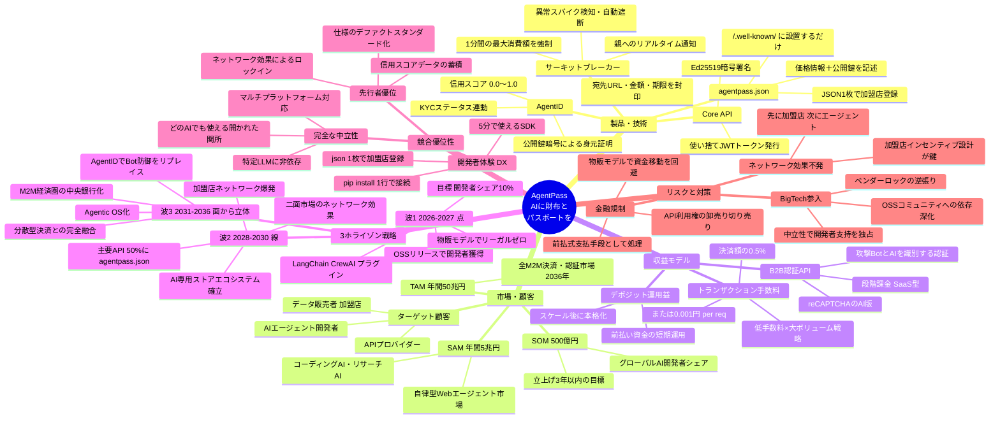

# AgentPass スパイダーマップ — 事業全体像

> GitHub / VS Code (Mermaid拡張) / Notion でそのままレンダリングされます。



---

## テキスト版スパイダーマップ（印刷・Miro貼付け用）

```
                              ┌─────────────┐
                              │  製品・技術  │
                              └──────┬──────┘
                    ┌─────────────────┼──────────────────┐
              Core API         サーキット         AgentID
           JWT・Ed25519         ブレーカー      信用スコア
           宛先URL封印         予算制限・検知    公開鍵認証
                                                       agentpass.json
                                                       JSON1枚設置
                     ┌──────────────────────────────────────┐
                     │                                      │
    ┌────────┐   ┌───┴───────────────────────────────┐   ┌──────────┐
    │ 市場   │   │           AgentPass                │   │収益モデル│
    │       │   │         AIに財布と                  │   │         │
    │TAM    │   │         パスポートを                 │   │手数料    │
    │50兆円 │   │                                    │   │0.5%     │
    │SAM    │   └───┬───────────────────────────────┘   │認証API  │
    │5兆円  │       │                                    │SaaS課金 │
    │SOM    │       │                                    │運用益   │
    │500億  │       │                                    └──────────┘
    └────────┘       │
                     ├──────────────────────────────────────┐
                     │                                      │
             ┌───────┴───────┐                    ┌─────────┴─────────┐
             │ 3ホライゾン   │                    │   競合優位性      │
             │               │                    │                   │
             │波1 点の制圧   │                    │ 完全な中立性      │
             │OSS・開発者獲得│                    │ 優れたDX         │
             │               │                    │ 先行者優位       │
             │波2 線の結合   │                    └─────────┬─────────┘
             │加盟店ネット爆発│                             │
             │               │                    ┌─────────┴─────────┐
             │波3 立体の完成 │                    │   リスク対策      │
             │中央銀行化     │                    │                   │
             └───────────────┘                    │ 金融規制→物販    │
                                                   │ BigTech→中立性  │
                                                   │ NW効果→加盟店先行│
                                                   └───────────────────┘
```

---

*AgentPass | 2026-05-16 | GitHub / VS Code / Notion でレンダリング可能*
